# Prak1_Probstat2023_C_5025211228


| Nama  | NRP |
| :-------------: | :-------------: |
| Muhammad Rifqi Fadhilah  | 5025211228  |


## Nomor 1

Probabilitas seorang bayi yang baru lahir berjenis kelamin laki-laki adalah 0,488. Jika kita asumsikan bahwa dalam satu hari di rumah sakit terdapat 10 kelahiran, maka:

## Nomor 1.a

Bagaimana pendistribusian banyak bayi laki-laki? Tentukan distribusi dengan parameter yang sesuai.

Jawaban:

```
Dalam hal ini, distribusi yang tepat adalah distribusi binomial karena hanya ada dua kemungkinan yaitu laki-laki atau perempuan. Oleh karena itu, karena terdapat lebih dari satu percobaan, maka distribusinya termasuk dalam distribusi binomial, bukan distribusi Bernoulli.Anda dapat menggunakan rumus berikut untuk menghitung probabilitas sukses (laki-laki) sebanyak k kali dari 10 percobaan: P(X=k) = (10Ck) 0.488^k (1-0.488)^(10-k)
```

## Nomor 1.b

Berapa probabilitas bahwa tepat tiga bayi di antaranya berjenis kelamin laki-laki?

### Jawaban:

```
jumlah_sukses <- 3
probabilitas_keberhasilan <- 0.488
jumlah_percobaan <- 10
hasil <- dbinom(x = jumlah_sukses, size = jumlah_percobaan, prob = probabilitas_keberhasilan)
hasil
```

### Pembahasan:
Code tersebut merupakan soal penggunaan fungsi dbinom() pada R, dengan argumen sebagai berikut:

- `x` = `jumlah_sukses` : variabel `jumlah_sukses` digunakan sebagai nilai `x` pada fungsi `dbinom()`, yang menunjukkan jumlah keberhasilan yang ingin dihitung probabilitasnya.

- `size` = `jumlah_percobaan` : variabel jumlah_percobaan digunakan sebagai nilai `size` pada fungsi `dbinom()`, yang menunjukkan jumlah percobaan yang dilakukan.

- `prob`= `probabilitas_keberhasilan` : variabel `probabilitas_keberhasilan` digunakan sebagai nilai `prob` pada fungsi `dbinom()`, yang menunjukkan probabilitas keberhasilan pada setiap percobaan.

Hasil dari fungsi `dbinom()` akan disimpan ke dalam variabel `hasil`, yang menunjukkan probabilitas terjadinya `jumlah_sukses` keberhasilan dalam `jumlah_percobaan` percobaan dengan probabilitas keberhasilan `probabilitas_keberhasilan`.

### Output:

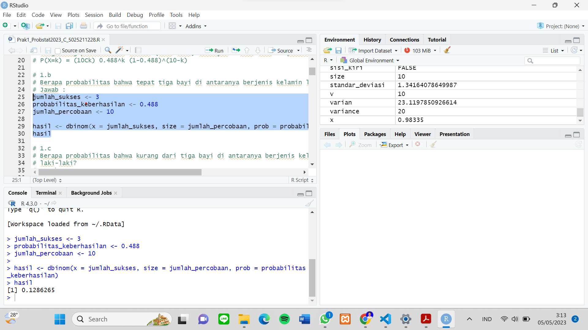

## Nomor 1.c

Berapa probabilitas bahwa kurang dari tiga bayi di antaranya berjenis kelamin laki-laki?

### Jawaban:

```
jumlah_kegagalan <- 2
probabilitas_keberhasilan <- 0.488
jumlah_percobaan <- 10
hasil <- pbinom(q = jumlah_kegagalan, size = jumlah_percobaan, prob = probabilitas_keberhasilan)
hasil
```

### Pembahasan:
Code tersebut merupakan soal penggunaan fungsi pbinom() pada R, dengan argumen sebagai berikut:

- `q` = `jumlah_kegagalan` : variabel `jumlah_kegagalan` digunakan sebagai nilai `q` pada fungsi `pbinom()`, yang menunjukkan jumlah kegagalan yang ingin dihitung probabilitasnya.

- `size` = `jumlah_percobaan` : variabel `jumlah_percobaan` digunakan sebagai nilai `size` pada fungsi `pbinom()`, yang menunjukkan jumlah percobaan yang dilakukan.

- `prob` = `probabilitas_keberhasilan` : variabel `probabilitas_keberhasilan` digunakan sebagai nilai `prob` pada fungsi `pbinom()`, yang menunjukkan probabilitas keberhasilan pada setiap percobaan.

Hasil dari fungsi `pbinom()` akan disimpan ke dalam variabel `hasil`, yang menunjukkan probabilitas terjadinya kegagalan sebanyak `jumlah_kegagalan` atau kurang dalam `jumlah_percobaan` percobaan dengan probabilitas keberhasilan `probabilitas_keberhasilan`.

### Output:

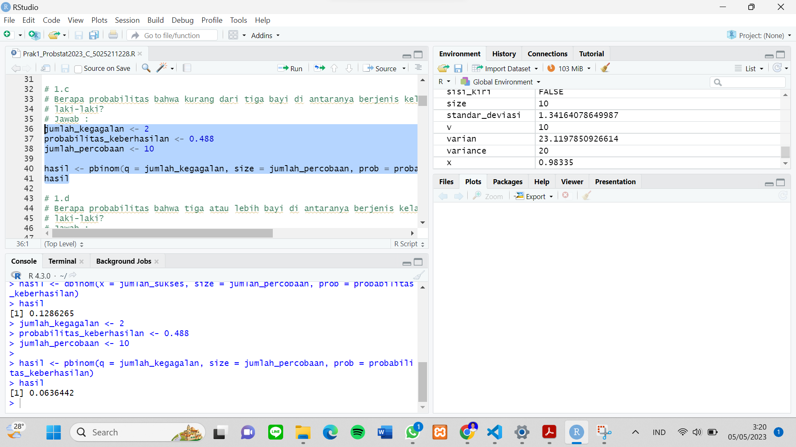

## Nomor 1.d

Berapa probabilitas bahwa tiga atau lebih bayi di antaranya berjenis kelamin laki-laki?

### Jawaban:

```
jumlah_kegagalan <- 2
probabilitas_keberhasilan <- 0.488
jumlah_percobaan <- 10
sisi_kiri <- FALSE

hasil <- pbinom(q = jumlah_kegagalan, size = jumlah_percobaan, prob = probabilitas_keberhasilan, lower.tail = sisi_kiri)
hasil
```

### Pembahasan:
Code tersebut juga merupakan soal penggunaan fungsi pbinom() pada R, dengan argumen sebagai berikut:

- `q` = `jumlah_kegagalan` : variabel `jumlah_kegagalan` digunakan sebagai nilai `q` pada fungsi `pbinom()`, yang menunjukkan jumlah kegagalan yang ingin dihitung probabilitasnya.

- `size` = `jumlah_percobaan` : variabel `jumlah_percobaan` digunakan sebagai nilai `size` pada fungsi `pbinom()`,` yang menunjukkan jumlah percobaan yang dilakukan.

- `prob` = `probabilitas_keberhasilan` : variabel `probabilitas_keberhasilan` digunakan sebagai nilai `prob` pada fungsi `pbinom()`, yang menunjukkan probabilitas keberhasilan pada setiap percobaan.

- `lower.tail` = `sisi_kiri` : variabel `sisi_kiri` digunakan sebagai nilai `lower.tail` pada fungsi `pbinom()`, yang menunjukkan apakah akan menghitung probabilitas pada sisi kiri atau kanan distribusi binomial.

- Jika `lower.tail` diatur sebagai `TRUE` (default), maka fungsi `pbinom()` akan menghitung probabilitas pada sisi kiri distribusi binomial (yaitu probabilitas kegagalan kurang dari atau sama dengan `jumlah_kegagalan`). Namun, jika `lower.tail `diatur sebagai `FALSE`, maka fungsi `pbinom()` akan menghitung probabilitas pada sisi kanan distribusi binomial (yaitu probabilitas kegagalan lebih dari `jumlah_kegagalan`).

Hasil dari fungsi `pbinom()` dengan argumen tersebut akan disimpan ke dalam variabel `hasil`, yang menunjukkan probabilitas terjadinya kegagalan lebih dari `jumlah_kegagalan` dalam `jumlah_percobaan `percobaan dengan probabilitas keberhasilan `probabilitas_keberhasilan`, jika `sisi_kiri` diatur sebagai `FALSE`.

### Output:

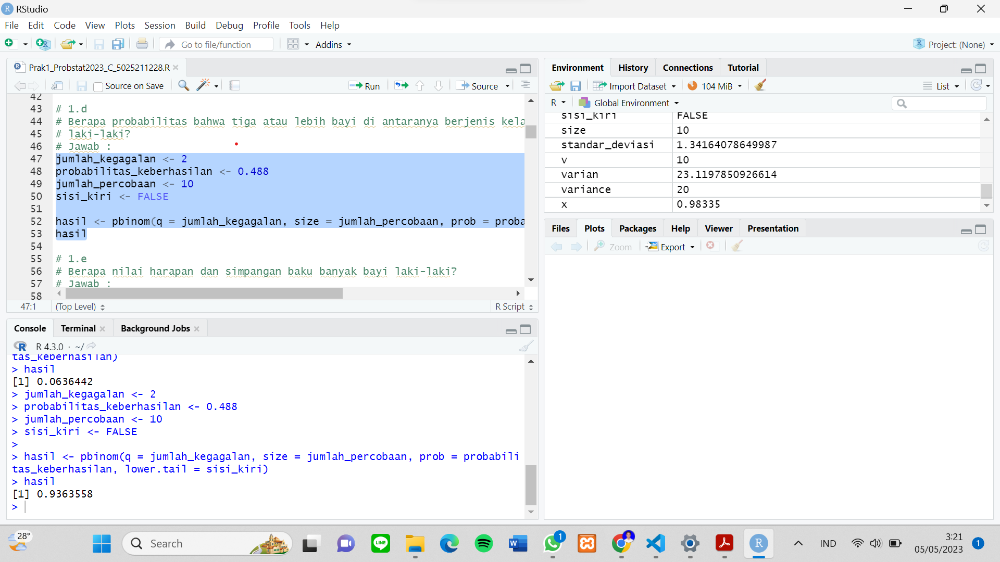

## Nomor 1.e

Berapa nilai harapan dan simpangan baku banyak bayi laki-laki?

### Jawaban:

```
jumlah_data <- 10
probabilitas_keberhasilan <- 0.488
nilai_harapan <- jumlah_data * probabilitas_keberhasilan
nilai_harapan
simpangan_baku <- sqrt(jumlah_data * probabilitas_keberhasilan * (1 - probabilitas_keberhasilan))
simpangan_baku
```

### Pembahasan:
Code tersebut merupakan soal penghitungan nilai harapan dan simpangan baku dari distribusi binomial pada R dengan menghitung beberapa nilai terlebih dahulu, dengan argumen sebagai berikut:

- `jumlah_data` = 10 : variabel `jumlah_data` menunjukkan jumlah data atau percobaan yang dilakukan.

- `probabilitas_keberhasilan` = 0.488 : variabel `probabilitas_keberhasilan` menunjukkan probabilitas keberhasilan pada setiap percobaan.

- `nilai_harapan` = `jumlah_data` * `probabilitas_keberhasilan` : variabel `nilai_harapan` menunjukkan nilai rata-rata atau nilai harapan dari distribusi binomial, yang dihitung dengan mengalikan jumlah percobaan dengan probabilitas keberhasilan pada setiap percobaan.

- `simpangan_baku` = `sqrt(jumlah_data * probabilitas_keberhasilan * (1 - probabilitas_keberhasilan))` : variabel `simpangan_baku` menunjukkan simpangan baku atau standard deviation dari distribusi binomial, yang dihitung dengan menggunakan rumus matematika, yaitu akar kuadrat dari jumlah percobaan dikali probabilitas keberhasilan dikali probabilitas kegagalan.

Setelah beberapa nilai dihitung, R akan menghasilkan output berupa nilai `nilai_harapan` dan `simpangan_baku` yang dapat digunakan untuk analisis lebih lanjut.

### Output:

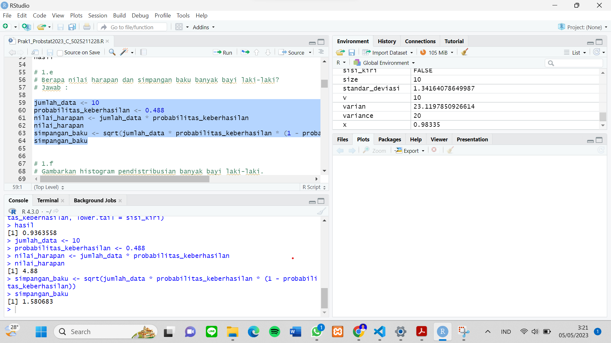

## Nomor 1.f

Gambarkan histogram pendistribusian banyak bayi laki-laki.

### Jawaban:

```
jumlah_data <- 0:10
jumlah_percobaan <- 10
probabilitas_keberhasilan <- 0.488

plot(jumlah_data, dbinom(x = jumlah_data, size = jumlah_percobaan, prob = probabilitas_keberhasilan), 
     type = 'h',
     main = 'Distribusi Binomial',
     xlab = 'Banyak bayi laki-laki',
     ylab = 'Probabilitas'
)
```

### Pembahasan:

Code tersebut merupakan soal pembuatan grafik distribusi binomial pada R dengan menggunakan fungsi `plot()`, dengan argumen sebagai berikut:

- `jumlah_data` = 0:10 : variabel `jumlah_data` menunjukkan jumlah data atau percobaan yang akan diplotkan pada sumbu x. Dalam kasus ini, data yang diplotkan adalah angka 0 hingga 10.

- `jumlah_percobaan` = 10 : variabel `jumlah_percobaan` menunjukkan jumlah percobaan atau sample size pada distribusi binomial.

- `probabilitas_keberhasilan` = 0.488 : variabel `probabilitas_keberhasilan` menunjukkan probabilitas keberhasilan pada setiap percobaan.

- `plot(jumlah_data, dbinom(x = jumlah_data, size = jumlah_percobaan, prob = probabilitas_keberhasilan), type = 'h', main = 'Distribusi Binomial', xlab = 'Banyak bayi laki-laki', ylab = 'Probabilitas')` : fungsi `plot()` digunakan untuk membuat grafik distribusi binomial dengan sumbu x berisi nilai-nilai dalam `jumlah_data`, dan sumbu y berisi probabilitas dari distribusi binomial yang dihitung menggunakan `dbinom()`, dengan argumen `x` sama dengan `jumlah_data`, `size` sama dengan `jumlah_percobaan`, dan `prob` sama dengan `probabilitas_keberhasilan`.`Argumen type = 'h'` menunjukkan bahwa jenis grafik yang digunakan adalah histogram dengan bentuk tegak lurus, `main` menunjukkan judul grafik, `xlab` menunjukkan label untuk sumbu x, dan `ylab` menunjukkan label untuk sumbu y.

Hasilnya adalah sebuah grafik distribusi binomial yang menunjukkan probabilitas keberhasilan pada setiap percobaan diwakili oleh kurva yang menunjukkan distribusi data. Pada grafik tersebut, sumbu x menunjukkan jumlah keberhasilan atau sukses dari percobaan yang dilakukan, sedangkan sumbu y menunjukkan probabilitas keberhasilan pada setiap percobaan. Dari grafik tersebut, dapat dilihat bahwa probabilitas tertinggi terjadi pada keberhasilan sekitar 5 kali dari 10 percobaan.

### Output:

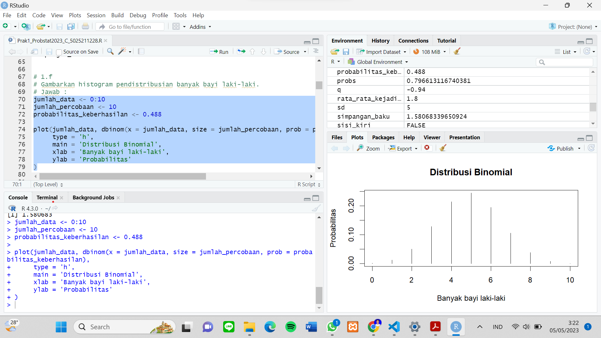

## Nomor 2

Misalkan banyak kematian karena kanker tulang untuk seluruh pekerja di pabrik ban dalam 20 tahun ke depan adalah 1,8.

## Nomor 2.a

Bagaimana pendistribusian banyak kematian karena kanker tulang? Tentukan distribusi dengan parameter yang sesuai.

### Jawaban:

```
Distribusi yang tepat untuk kasus ini adalah distribusi Poisson, karena kejadian tersebut terjadi pada lingkup ruang dan waktu tertentu. Rumus probabilitas distribusi Poisson adalah P(X=k) = e^(-λ) (λ^k / k!)
```

## Nomor 2.b

Ada 4 kematian akibat kanker tulang yang dilaporkan di kalangan pekerja pabrik ban, apakah itu peristiwa yang tidak biasa? Hitung probabilitas berdasarkan distribusi yang telah dipilih.

### Jawaban:
Kejadian ini dapat dikategorikan sebagai kejadian yang tidak biasa, meskipun tidak terlalu jarang. Hal ini disebabkan karena kemungkinan terjadinya tidak terlalu berbeda jauh dengan kemungkinan terjadinya di sekitar nilai rata-rata (λ).


```
jumlah_kejadian <- 4
rata_rata_kejadian <- 1.8
hasil_probabilitas <- dpois(x = jumlah_kejadian, lambda = rata_rata_kejadian)
hasil_probabilitas
```

### Pembahasan:

- `jumlah_kejadian <- 4`: nilai yang akan digunakan sebagai input fungsi `dpois`, yaitu jumlah kejadian yang ingin dihitung probabilitasnya.
- `rata_rata_kejadian <- 1.8`: nilai parameter lambda yang digunakan pada distribusi Poisson. Parameter ini merepresentasikan rata-rata jumlah kejadian pada suatu periode waktu tertentu.
- `hasil_probabilitas <- dpois(x = jumlah_kejadian, lambda = rata_rata_kejadian)`: menghitung probabilitas suatu kejadian (jumlah_kejadian) pada distribusi Poisson dengan parameter lambda (rata_rata_kejadian). Hasil probabilitas tersebut disimpan dalam variabel `hasil_probabilitas`.

Dalam soal tersebut, variabel `hasil_probabilitas` akan menyimpan nilai probabilitas dari kejadian sebanyak 4 kali terjadi dengan rata-rata kejadian sebanyak 1.8 kali.

### Output:
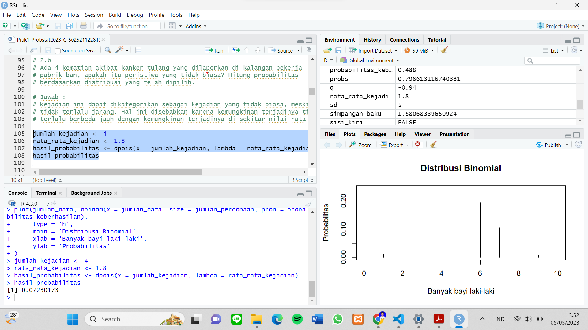

## Nomor 2.c

Berapa peluang paling banyak 4 kematian akibat kanker tulang?

### Jawaban:

```
jumlah_kejadian <- 4
rata_rata_kejadian <- 1.8
hasil_probabilitas_kumulatif <- ppois(q = jumlah_kejadian, lambda = rata_rata_kejadian)
hasil_probabilitas_kumulatif
```

### Pembahasan:

- `jumlah_kejadian <- 4`: nilai yang akan digunakan sebagai input fungsi `ppois`, yaitu jumlah kejadian yang ingin dihitung probabilitas kumulatifnya.
- `rata_rata_kejadian <- 1.8`: nilai parameter lambda yang digunakan pada distribusi Poisson. Parameter ini merepresentasikan rata-rata jumlah kejadian pada suatu periode waktu tertentu.
- `hasil_probabilitas_kumulatif <- ppois(q = jumlah_kejadian, lambda = rata_rata_kejadian)`: menghitung probabilitas kumulatif suatu kejadian (jumlah_kejadian) pada distribusi Poisson dengan parameter lambda (rata_rata_kejadian). Hasil probabilitas kumulatif tersebut disimpan dalam variabel `hasil_probabilitas_kumulatif`.

Dalam soal tersebut, variabel `hasil_probabilitas_kumulatif` akan menyimpan nilai probabilitas kumulatif dari kejadian sebanyak 4 kali terjadi atau kurang, dengan rata-rata kejadian sebanyak 1.8 kali.

### Output:
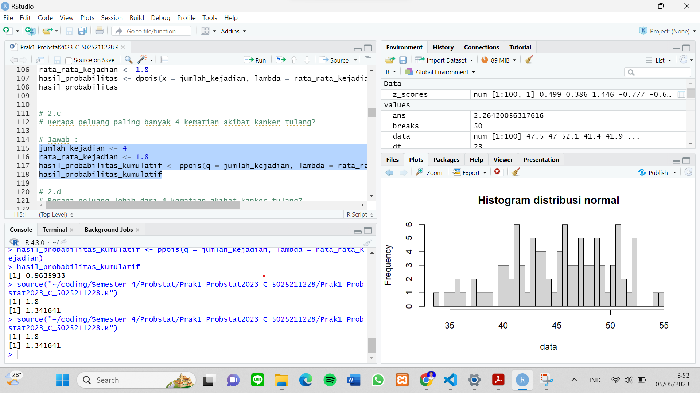

## Nomor 2.d

Berapa peluang lebih dari 4 kematian akibat kanker tulang?

### Jawaban:

```
jumlah_kejadian <- 4
rata_rata_kejadian <- 1.8
sisi_kiri <- FALSE
hasil_probabilitas_kumulatif <- ppois(q = jumlah_kejadian, lambda = rata_rata_kejadian, lower.tail = sisi_kiri)
hasil_probabilitas_kumulatif
```

### Pembahasan:

- `jumlah_kejadian <- 4`: menentukan jumlah kejadian yang ingin dihitung probabilitasnya.

- `rata_rata_kejadian <- 1.8`: menentukan rata-rata kejadian dalam satu waktu.

- `sisi_kiri <- FALSE`: menentukan apakah sisi distribusi yang dihitung adalah kiri atau kanan. Pada kode tersebut, sisi yang dihitung adalah sisi kanan, sehingga `sisi_kiri` di-set menjadi `FALSE`.

- `hasil_probabilitas_kumulatif <- ppois(q = jumlah_kejadian, lambda = rata_rata_kejadian, lower.tail = sisi_kiri)`: menghitung probabilitas kumulatif dengan menggunakan fungsi `ppois()`. Fungsi tersebut menerima tiga argumen yaitu `q` (jumlah kejadian), `lambda` (rata-rata kejadian dalam satu waktu), dan `lower.tail` (sisi distribusi yang dihitung). Hasilnya disimpan dalam variabel `hasil_probabilitas_kumulatif`. Pada kode tersebut, probabilitas kumulatif sisi kanan dihitung, sehingga `lower.tail` di-set menjadi `FALSE`

### Output:
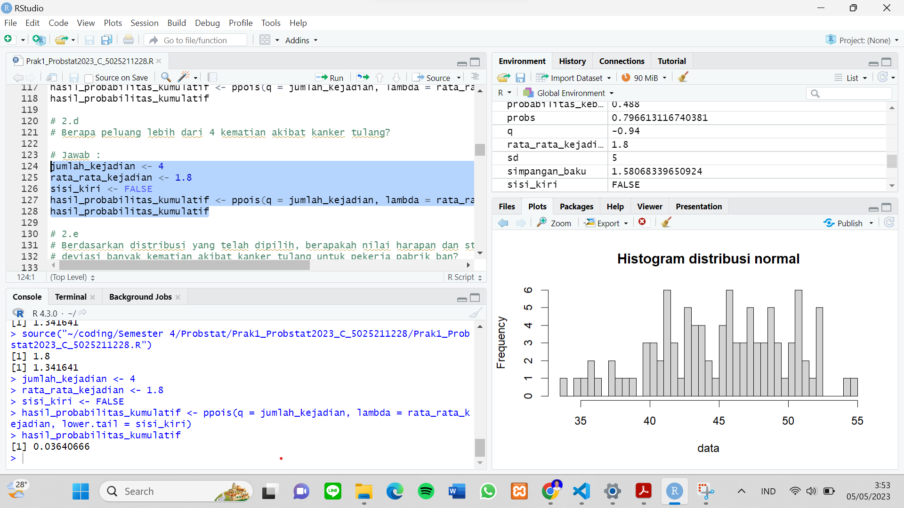

## Nomor 2.e

Berdasarkan distribusi yang telah dipilih, berapakah nilai harapan dan standar deviasi banyak kematian akibat kanker tulang untuk pekerja pabrik ban?

### Jawaban:

```
nilai_harapan <- 1.8
print(nilai_harapan)
standar_deviasi <- 1.8^0.5
print(standar_deviasi)
```

### Pembahasan:

- `nilai_harapan <- 1.8`: Nilai harapan (mean) dihitung dengan mengalikan parameter lambda (rata-rata kejadian) dengan 1.8, kemudian disimpan ke dalam variabel `nilai_harapan`.

- `print(nilai_harapan)`: Menampilkan nilai harapan yang telah dihitung pada baris sebelumnya.

- `standar_deviasi <- 1.8^0.5`: Standar deviasi dihitung dengan menghitung akar kuadrat dari parameter lambda, kemudian disimpan ke dalam variabel standar_deviasi.

- `print(standar_deviasi)`: Menampilkan nilai standar deviasi yang telah dihitung pada baris sebelumnya.

### Output:
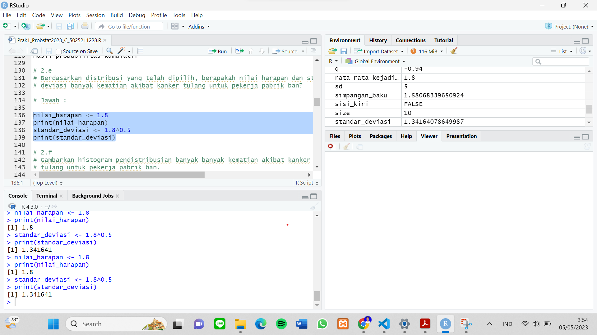

## Nomor 2.f

Gambarkan histogram pendistribusian banyak banyak kematian akibat kanker tulang untuk pekerja pabrik ban.

### Jawaban:

```
n <- seq(0, 10)
lambda <- 1.8
plot(n, dpois(n, lambda),
     type='h',
     main='Distribusi Poisson',
     ylab='Probabilitas',
     xlab ='Banyak kejadian'
)
```

### Pembahasan:

- `n <- seq(0, 10)`: Membuat vektor n yang berisi bilangan bulat dari 0 hingga 10.

- `lambda <- 1.8` : Mendefinisikan nilai lambda sebesar 1.8.

- `plot(n, dpois(n, lambda), type='h', main='Distribusi Poisson', ylab='Probabilitas', xlab ='Banyak kejadian') `: Menghasilkan plot dengan sumbu x berisi nilai-nilai dari vektor n, dan sumbu y berisi probabilitas distribusi Poisson dengan parameter lambda 1.8 pada setiap titik di sumbu x. Parameter `type='h'` menandakan bahwa plot tersebut akan dihasilkan dalam bentuk histogram. `main` digunakan untuk memberikan judul pada plot, `ylab` digunakan untuk memberikan label pada sumbu y, dan `xlab` digunakan untuk memberikan label pada sumbu x

### Output:
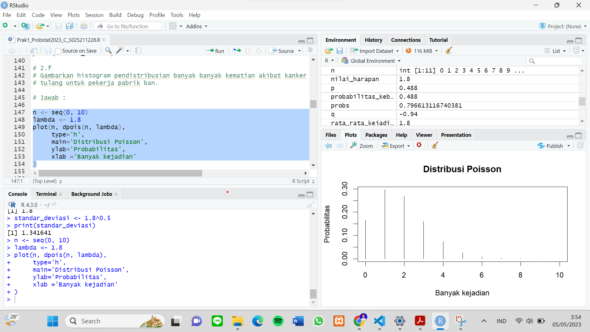


## Nomor 2.g

Gunakan simulasi untuk memeriksa hasil sebelumnya.

### Jawaban:

```
n <- 10
lambda <- 1.8
set.seed(123456789)
ans <- replicate(n, rpois(n=1, lambda=lambda))
ans <- unlist(ans)
ans
```

### Pembahasan:

Kode tersebut bertujuan untuk menghasilkan 10 bilangan acak yang mengikuti distribusi Poisson dengan parameter lambda = 1.8 menggunakan fungsi `rpois()`.

- `n` menyatakan jumlah bilangan acak yang ingin dihasilkan, yaitu 10.

- `lambda` menyatakan parameter lambda dalam distribusi Poisson, yaitu 1.8.

- `set.seed(123456789)` digunakan untuk mengatur "seed" pada generator bilangan acak, sehingga bilangan acak yang dihasilkan akan sama jika kode tersebut dijalankan kembali di waktu yang berbeda dengan pengaturan seed yang sama.

- `ans <- replicate(n, rpois(n=1, lambda=lambda))` digunakan untuk menghasilkan 10 bilangan acak menggunakan fungsi `rpois()`, dengan parameter `n=1` untuk menghasilkan satu bilangan acak setiap kali fungsi dijalankan. Fungsi ini dijalankan sebanyak 10 kali menggunakan `replicate()`.

- `ans <- unlist(ans)` digunakan untuk mengubah hasil yang awalnya dalam bentuk matriks menjadi vektor, sehingga bisa langsung diakses dan diolah dalam bentuk vektor.

### Output:
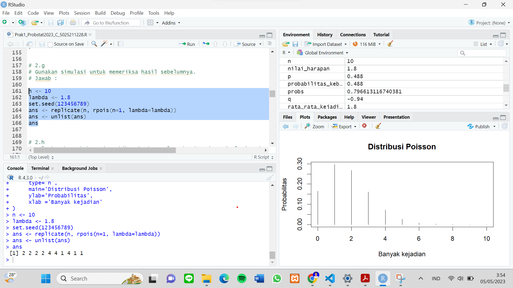

## Nomor 2.h

Jelaskan banyak kematian akibat kanker tulang berdasarkan simulasi Anda. Bandingkan jawaban pada pertanyaan 2d dengan hasil simulasi Anda.

### Jawaban:

```
Dalam simulasi ini dengan set.seed(123456789) dan jumlah simulasi n = 10, diperoleh hasil [2,2,2,2,4,4,1,4,1,1]. Hasil yang muncul memang beragam, tetapi tidakterlalu jauh dari nilai lambda/mean yaitu 1.8 karena kemungkinan terbesar kematianterjadi pada daerah dekat lambda, yaitu rentang 0-5. Seperti pada jawaban 2d, kejadiankematian = 4 bukanlah hal yang biasa, namun juga tidak sangat jarang terjadi.Hal ini dapat dibuktikan dengan kemunculan yang cukup sering pada simulasi (walaupun tergantung pada seed pada simulasi). Jumlah kematian yang paling sering terjadi adalah sekitar 1 atau 2 setelah dibandingkan dengan beberapa seed lain
```

## Nomor 3

Diketahui nilai x = 3 dan v = 10. Tentukan:

## Nomor 3.a

Fungsi probabilitas dari distribusi Chi-Square.

### Jawaban:

```
x <- 3
v <- 10
ans <- dchisq(x=x, df=v)
ans
```

### Pembahasan:

-  `x <- 3`: sebuah variabel x didefinisikan dengan nilai 3.

- `v <- 10`: sebuah variabel v didefinisikan dengan nilai 10, yang merupakan derajat kebebasan dari distribusi chi-square yang akan dihitung.

- `ans <- dchisq(x=x, df=v)`: fungsi `dchisq()` dipanggil dengan argumen x = 3 dan df = 10 (derajat kebebasan). Fungsi ini akan mengembalikan nilai probabilitas dari distribusi chi-square pada titik x = 3 dan derajat kebebasan v = 10.

- `ans`: nilai probabilitas tersebut disimpan dalam variabel ans.

### Output:

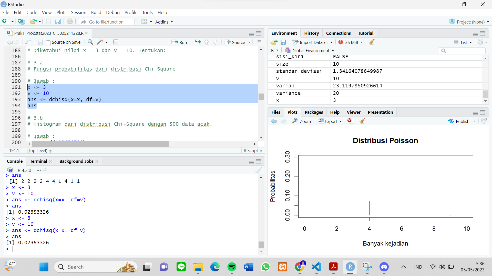

## Nomor 3.b

Histogram dari distribusi Chi-Square dengan 500 data acak.

### Jawaban:

```
set.seed(123456789)
n <- 500
v <- 10
x <- rchisq(n, v)
hist(x, xlab = "X", ylab = "Jumlah", main = "Histogram Chi-Square")
```

### Pembahasan:

- `set.seed(123456789)` digunakan untuk mengatur biji acak (random seed) pada fungsi-fungsi pengacakan seperti `rchisq()`. Ini digunakan agar setiap kali kode dijalankan, hasil pengacakan selalu sama.

- `n <- 500` adalah jumlah sampel yang akan digunakan dalam pengambilan sampel acak dari distribusi chi-square.

- `v <- 10 `adalah jumlah derajat kebebasan dari distribusi chi-square yang digunakan.

- `x <- rchisq(n, v)` adalah fungsi untuk menghasilkan sampel acak dari distribusi chi-square dengan `n` sebagai jumlah sampel dan `v` sebagai jumlah derajat kebebasan.

- `hist(x, xlab = "X", ylab = "Jumlah", main = "Histogram Chi-Square")` digunakan untuk menampilkan histogram dari sampel acak yang dihasilkan dengan `x` sebagai variabel yang diplot, `xlab` dan `ylab` untuk memberikan label pada sumbu x dan y, serta main untuk memberikan judul pada plot.

### Output:

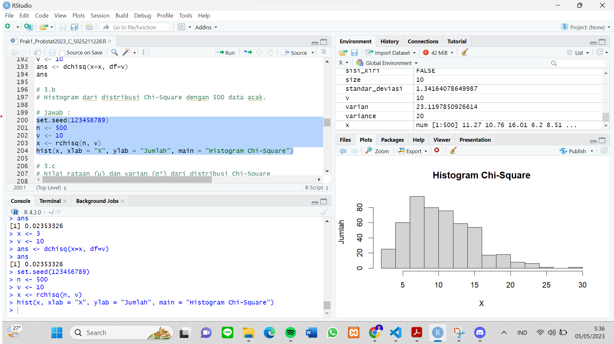

## Nomor 3.c

Nilai rataan (μ) dan varian (σ²) dari distribusi Chi-Square.

### Jawaban:

```
mean <- v <- 10
mean
variance <- 2 * v
variance
```

### Pembahasan:

Pada kode tersebut, terdapat dua variabel yang dideklarasikan yaitu `mean` dan `variance`.

- Pada baris pertama, variabel `mean` dideklarasikan dengan nilai 10.

- Pada baris kedua, variabel `variance` dideklarasikan dengan nilai 2 dikali nilai v yang juga sama dengan 10. Sehingga variabel `variance` memiliki nilai 20.

Kedua variabel tersebut merupakan contoh nilai rata-rata dan variansi distribusi chi-square. Nilai rata-rata distribusi chi-square dengan derajat kebebasan v adalah sama dengan nilai derajat kebebasan itu sendiri. Sementara itu, nilai variansi distribusi chi-square dengan derajat kebebasan v adalah dua kali nilai derajat kebebasan tersebut.

### Output:

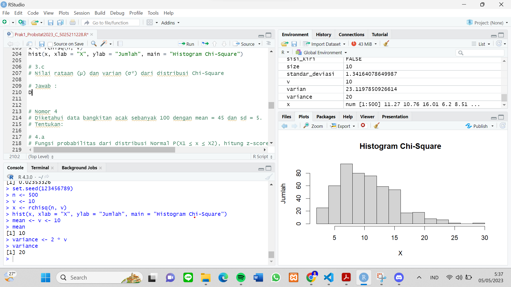

## Nomor 4

Diketahui data bangkitan acak sebanyak 100 dengan mean = 45 dan sd = 5. Tentukan:

## Nomor 4.a

Fungsi probabilitas dari distribusi Normal P(X1 ≤ x ≤ X2), hitung z-scorenya dan plot data bangkitan acaknya dalam bentuk grafik. Petunjuk (gunakan fungsi plot()).
<br>
Keterangan:

X1 = Bilangan bulat terdekat di bawah rata-rata
<br>
X2 = Bilangan bulat terdekat di atas rata-rata
<br>
Contoh data:
11
<br>
1,2,4,2,6,3,10,11,5,3,6,8
<br>
rata-rata = 5.083333
<br>
X1 = 5
<br>
X2 = 6

### Jawaban:

```
set.seed(123456789)
n <- 100
mean <- 45
sd <- 5
data <- rnorm(n=n, mean=mean, sd=sd)
data
summary(data)
z_scores <- scale(data)
z_scores
probs <- pnorm(runif(1, mean, max(data)), mean, sd) - pnorm(runif(1, min(data), mean), mean, sd)
probs
plot(data)
```

### Pembahasan:

- set.seed(123456789)`: mengatur seed untuk menghasilkan angka random yang sama setiap kali kode dijalankan.

- `n <- 100`: menetapkan nilai `n` sebesar 100.

- `mean <- 45`: menetapkan nilai rata-rata (`mean`) sebesar 45.

- `sd <- 5`: menetapkan nilai standar deviasi (`sd`) sebesar 5.

- `data <- rnorm(n=n, mean=mean, sd=sd)`: membuat vektor `data` dengan 100 elemen yang dihasilkan dari distribusi normal dengan rata-rata 45 dan standar deviasi 5.

- `data`: menampilkan vektor `data`.

- `summary(data)`: menampilkan ringkasan statistik dari vektor `data`.

- `z_scores <- scale(data)`: membuat vektor `z_scores` yang berisi nilai-nilai data yang telah discaling, yaitu nilai rata-rata 0 dan standar deviasi 1.

- `z_scores`: menampilkan vektor `z_scores`.

- `probs <- pnorm(runif(1, mean, max(data)), mean, sd) - pnorm(runif(1, min(data), mean), mean, sd)`: menghitung probabilitas dengan mengambil dua nilai acak dari distribusi uniform, yaitu dari `mean` hingga nilai maksimum `data` dan dari nilai minimum `data` hingga `mean`, kemudian menghitung selisih antara nilai distribusi normal kumulatif dari dua nilai tersebut.

- `probs`: menampilkan nilai probabilitas yang dihitung pada langkah sebelumnya.

- `plot(data)`: membuat histogram untuk menampilkan distribusi data pada vektor `data`.

### Output:

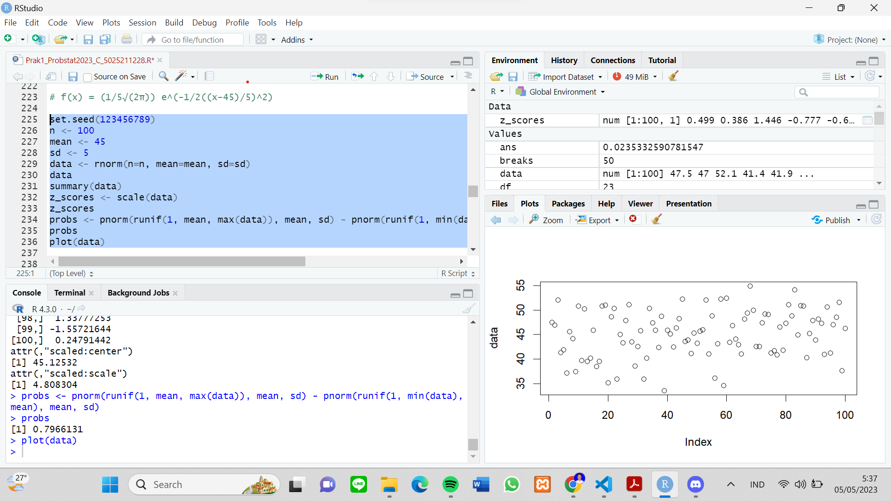

## Nomor 4.b

Gambarkan histogram dari distribusi Normal dengan breaks 50

### Jawaban:

```
set.seed(123456789)
n <- 100
mean <- 45
sd <- 5
data <- rnorm(n=n, mean=mean, sd=sd)
breaks = 50
hist(data, breaks, main = "Histogram distribusi normal")
```

### Pembahasan:

- `set.seed(123456789)` digunakan untuk menset seed pada fungsi random number generator, sehingga angka yang dihasilkan dari fungsi random dapat di-reproduce kembali jika diperlukan.

- `n <- 100` mendefinisikan jumlah data yang ingin digenerate.

- `mean <- 45` mendefinisikan rata-rata distribusi normal.

- `sd <- 5` mendefinisikan standar deviasi distribusi normal.

- `data <- rnorm(n=n, mean=mean, sd=sd)` meng-generate 100 data dengan menggunakan fungsi `rnorm()`. `n` menunjukkan jumlah data yang ingin digenerate, `mean` adalah rata-rata distribusi normal, dan `sd` adalah standar deviasi distribusi normal.

- `breaks = 50` menentukan jumlah bin/histogram yang ingin digunakan dalam visualisasi histogram.

- `hist(data, breaks, main = "Histogram distribusi normal")` menghasilkan histogram distribusi normal dengan menggunakan data yang digenerate pada baris sebelumnya, dengan menggunakan `breaks` sebagai jumlah bin/histogram. Argumen `main` digunakan untuk memberikan judul pada histogram.

### Output:

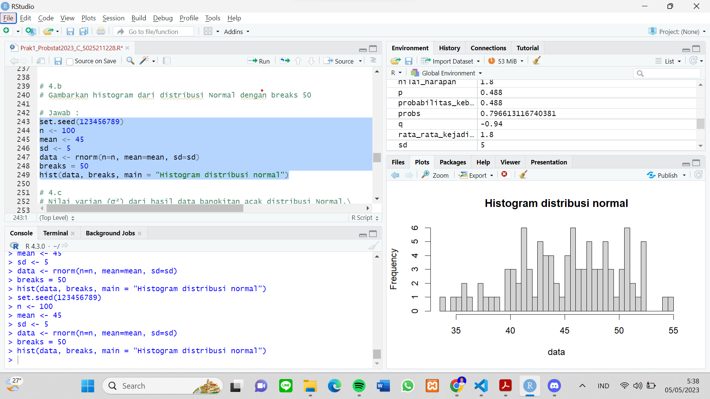

## Nomor 4.c

Nilai varian (σ²) dari hasil data bangkitan acak distribusi Normal.

### Jawaban:

```
set.seed(123456789)
n <- 100
mean <- 45
sd <- 5
data <- rnorm(n=n, mean=mean, sd=sd)
varian <- var(data)
varian
```

### Pembahasan:

- `set.seed(123456789)`: digunakan untuk memberikan seed pada fungsi random number generator sehingga hasil yang dihasilkan dapat direproduksi kembali.

- `n <- 100`: menentukan jumlah observasi yang akan dibuat.

- `mean <- 45`: menentukan rata-rata distribusi normal yang akan dibuat.

- `sd <- 5`: menentukan standar deviasi distribusi normal yang akan dibuat.

- `data <- rnorm(n=n, mean=mean, sd=sd)`: membuat distribusi normal dengan `n` jumlah observasi, `mean` rata-rata, dan `sd` standar deviasi.

- `varian <- var(data)`: menghitung varian dari distribusi normal yang telah dibuat.

Dengan demikian, variabel `varian` akan berisi nilai varian dari distribusi normal yang dibuat sebelumnya.

### Output:

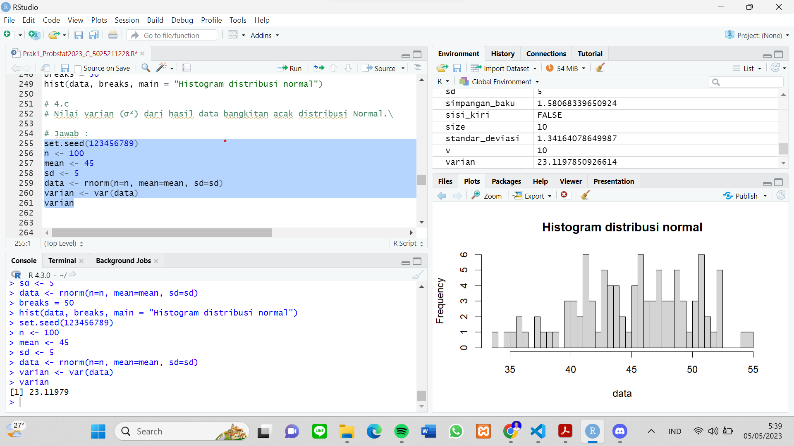

## Nomor 5

Kerjakanlah menggunakan distribusi T-Student.

## Nomor 5.a

Berapa probabilitas terjadinya suatu peristiwa acak X kurang dari -2,34 dengan 6 derajat kebebasan?

### Jawaban:

```
q <- -2.34
df <- 6
ans <- pt(q=q, df=df)
ans
```

### Pembahasan:

- `q <- -2.34`: menginisialisasi variabel `q` dengan nilai -2.34.

- `df <- 6`: menginisialisasi variabel `df` dengan nilai 6, yang merupakan derajat kebebasan (degrees of freedom) distribusi t-Student.

- `ans <- pt(q=q, df=df)`: menghitung probabilitas (p-value) distribusi t-Student dengan menginputkan nilai `q` dan `df` ke fungsi `pt`. Hasilnya disimpan ke dalam variabel `ans`.

- `ans`: mencetak hasil probabilitas (p-value) yang telah dihitung sebelumnya.

### Output:

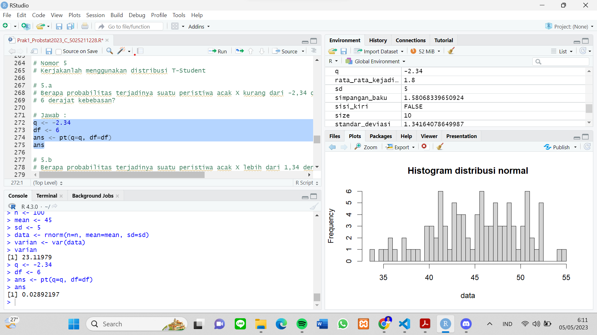

## Nomor 5.b

Berapa probabilitas terjadinya suatu peristiwa acak X lebih dari 1,34 dengan 6 derajat kebebasan?

### Jawaban:

```
q <- 1.34
df <- 6
left = FALSE
ans <- pt(q=q, df=df, lower.tail = left)
ans
```

### Pembahasan:

- `q <- 1.34`: inisialisasi variabel `q` dengan nilai 1.34.

- `df <- 6`: inisialisasi variabel `df` dengan nilai 6.

- `left = FALSE`: inisialisasi variabel left dengan nilai `FALSE`, yang berarti probabilitas yang akan dihitung adalah probabilitas di sebelah kanan nilai `q`.

- `ans <- pt(q=q, df=df, lower.tail = left)`: menghitung probabilitas dengan memanggil fungsi `pt()`, dengan parameter `q`, `df`, dan `lower.tail` sesuai dengan nilai-nilai variabel yang telah diinisialisasi sebelumnya.

- `ans`: mencetak hasil perhitungan probabilitas.

### Output:

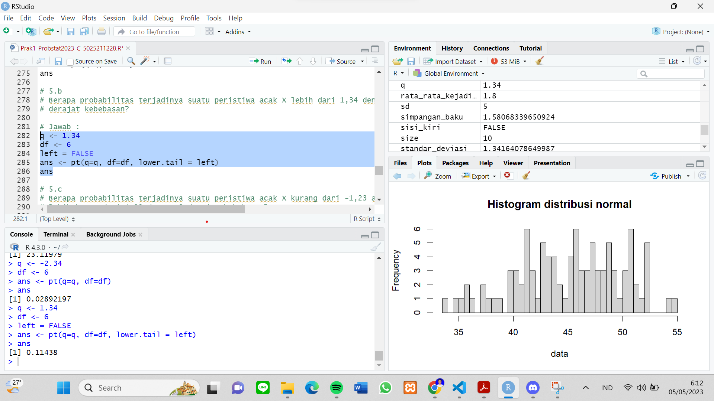

## Nomor 5.c

Berapa probabilitas terjadinya suatu peristiwa acak X kurang dari -1,23 atau lebih besar dari 1,23 dengan 3 derajat kebebasan?

### Jawaban:

```
q <- -1.23
df <- 3
ans <- 2 * pt(q=q, df=df)
ans
```

### Pembahasan:

- `q <- -1.23` : variabel `q` didefinisikan sebagai -1.23.

- `df <- 3` : variabel `df` didefinisikan sebagai 3, yaitu derajat kebebasan distribusi t-student.

- `ans <- 2 * pt(q=q, df=df)` : variabel `ans` didefinisikan sebagai hasil perkalian 2 dengan nilai probabilitas dari distribusi t-student dengan parameter `q` dan `df`. `pt()` adalah fungsi dalam R yang digunakan untuk menghitung probabilitas kumulatif dari distribusi t-student, dengan `q` sebagai nilai yang dicari probabilitasnya, `df` sebagai derajat kebebasan, dan `lower.tail` yang secara default bernilai `TRUE`, mengindikasikan bahwa probabilitas yang dicari adalah untuk nilai yang lebih kecil atau sama dengan nilai `q`. Karena pada kode ini menginginkan probabilitas untuk nilai yang lebih kecil atau lebih besar dari `q`, maka diberikan parameter `lower.tail` = `FALSE`. Kemudian hasil dari probabilitas tersebut dikalikan dengan 2, karena menghitung probabilitas untuk distribusi dua sisi.

### Output:

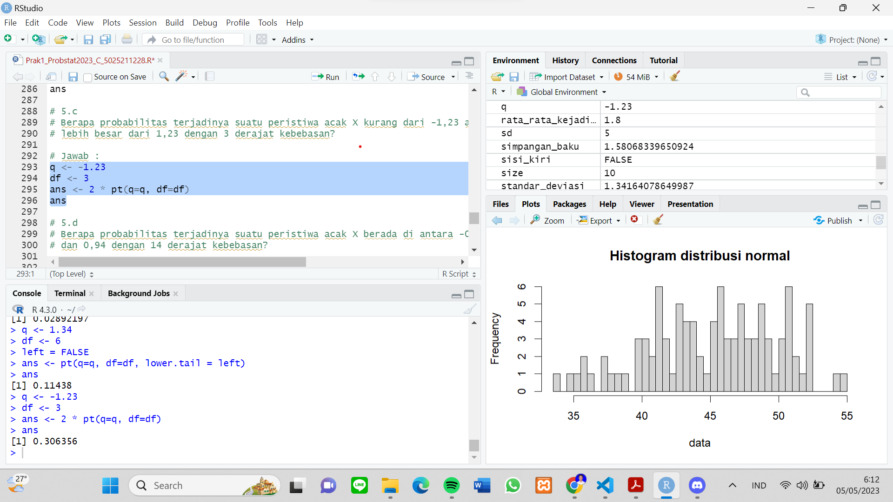

## Nomor 5.d

Berapa probabilitas terjadinya suatu peristiwa acak X berada di antara -0,94 dan 0,94 dengan 14 derajat kebebasan?

### Jawaban:

```
q <- -0.94
df <- 14
ans <- 1 - ( 2 * pt(q=q, df=df))
ans
```

### Pembahasan:

- `q <- -0.94`: mendefinisikan nilai t-statistik sebesar -0.94.

- `df <- 14`: mendefinisikan derajat kebebasan distribusi t-student sebesar 14.

- `ans <- 1 - (2 * pt(q=q, df=df))`: menghitung p-value dengan cara mencari nilai probabilitas di atas t-statistik -0.94 dan di bawah -(-0.94) = 0.94 pada distribusi t-student dengan df=14, lalu hasilnya dikurangi dari 1 dan dikalikan dengan 2.

### Output:

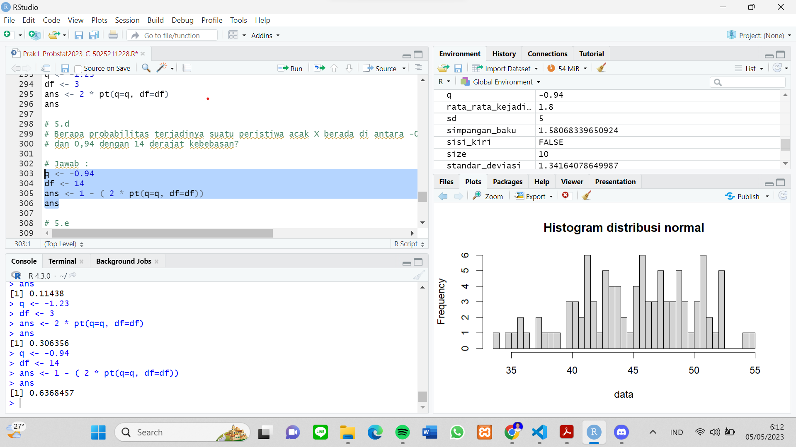

## Nomor 5.e

Berapa nilai t-score dengan 5 derajat kebebasan yang memiliki luasan 0,0333 satuan persegi di bawah kurva dan di sebelah kiri t-score tersebut?

### Jawaban:

```
x <- 0.0333
df <- 5
ans <- qt(x, df=df)
ans
```

### Pembahasan:

- `x <- 0.0333`: nilai proporsi (level signifikansi) yang dicari quantile-nya.

- `df <- 5`: derajat kebebasan dari t-distribution.

- `ans <- qt(x, df=df)`: menghitung quantile dari t-distribution dengan menggunakan nilai proporsi dan derajat kebebasan yang telah didefinisikan sebelumnya. Hasilnya disimpan dalam variabel `ans`.

### Output:

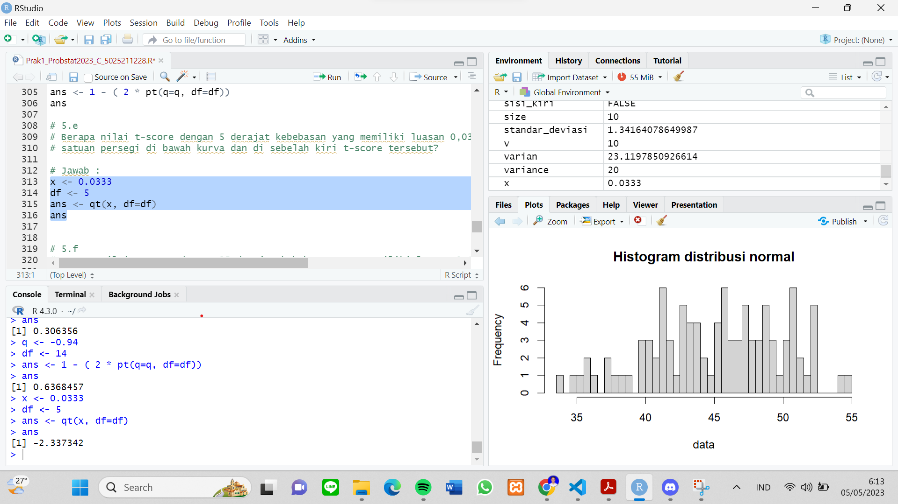

## Nomor 5.f

Berapa nilai t-score dengan 25 derajat kebebasan yang memiliki luasan 0,125 satuan persegi di bawah kurva dan di sebelah kanan t-score tersebut?

### Jawaban:

```
x <- 1 - 0.125
df <- 25
ans <- qt(x, df=df)
ans
```

### Pembahasan:

- `x <- 1 - 0.125`: disini nilai probabilitas yang dicari adalah 1 - 0.125 = 0.875, karena qt() menghitung probabilitas pada tail kiri.

- `df <- 25`: derajat kebebasan (degree of freedom) pada distribusi t-student.

- `ans <- qt(x, df=df)`: qt() merupakan fungsi dalam R yang digunakan untuk menghitung nilai t-score yang memiliki probabilitas tertentu pada distribusi t-student. Disini dihitung nilai t-score dengan probabilitas 0.875 pada distribusi t-student dengan df = 25. Hasilnya akan disimpan dalam variabel `ans`.

### Output:


## Nomor 5.g

Berapa nilai t-score dengan 11 derajat kebebasan yang memiliki luasan 0,75 satuan persegi di bawah kurva dan di antara t-score tersebut dan negatif dari nilai t-score tersebut?

### Jawaban:

```
x <- 0.75 + ((1-0.75)/2)
df <- 11
ans <- qt(x, df=df)
ans
```

### Pembahasan:

- `x <- 0.75 + ((1-0.75)/2)` menentukan nilai kritis pada distribusi t-student dengan degree of freedom 11 untuk confidence level 75%.

-` df <- 11` menentukan degree of freedom (derajat kebebasan) sebesar 11.

- `ans <- qt(x, df=df)` menghitung nilai t-score pada distribusi t-student dengan degree of freedom 11 untuk nilai kritis yang sudah ditentukan sebelumnya pada variabel `x`. Hasilnya akan disimpan pada variabel `ans`.

### Output:

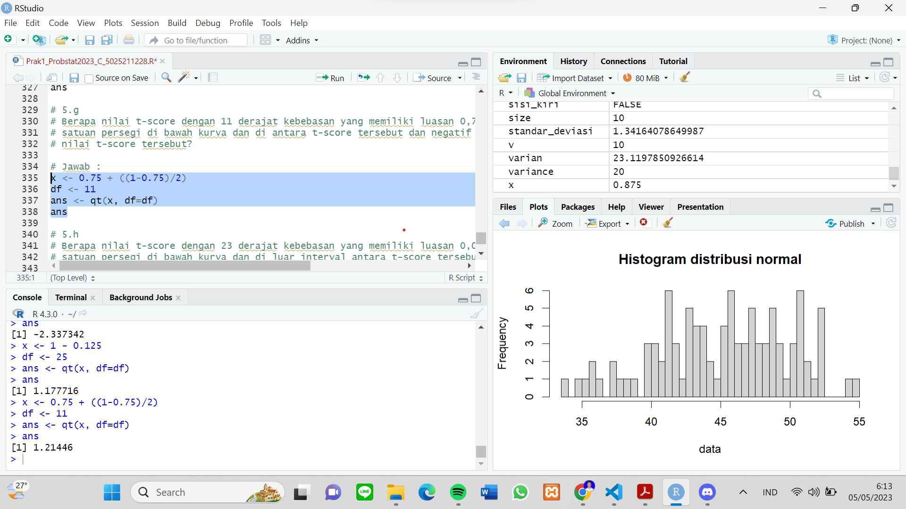

## Nomor 5.h

Berapa nilai t-score dengan 23 derajat kebebasan yang memiliki luasan 0,0333 satuan persegi di bawah kurva dan di luar interval antara t-score tersebut dan negatif dari nilai t-score tersebut?

### Jawaban:

```
x <- 1 - (0.0333/2)
df <- 23
ans <- qt(x, df=df)
ans
```

### Pembahasan:

 - `x <- 1 - (0.0333/2)` menginisialisasi variabel `x` dengan nilai 0.98335. 
 
- `df <- 23` menginisialisasi variabel `df` dengan nilai 23. 
 
- `ans <- qt(x, df=df)`, fungsi `qt()` digunakan untuk menghitung nilai dari quantile t-distribution dengan derajat kebebasan 23 pada probabilitas 1 - 0.0333/2 = 0.98335. Hasilnya disimpan pada variabel `ans`.

### Output:

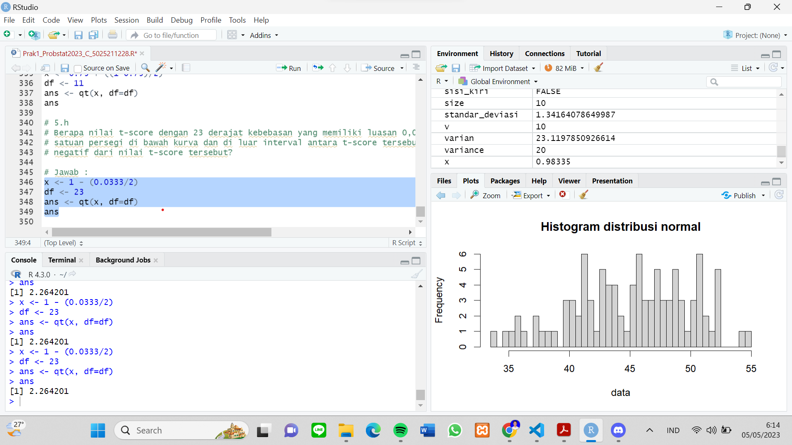